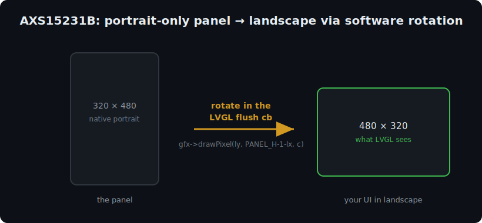

# AXS15231B Landscape (480x320) with LVGL v8

Run a **3.5" AXS15231B QSPI panel** (as found on boards like the
**Guition JC3248W535**) in **landscape 480x320** using **LVGL v8**, even
though the panel is natively **portrait 320x480** and the common Arduino
drivers do **not** expose a hardware landscape mode.

The trick: **rotate in software inside the LVGL flush callback.**



## The problem

- The AXS15231B panel scans natively in **portrait**: 320 wide x 480 tall.
- It is driven over a **QSPI** bus.
- The widely-used `Arduino_GFX` / `Arduino_AXS15231B` driver does **not**
  provide a working `MADCTL` landscape rotation for this controller, so you
  cannot simply ask the panel to rotate. `setRotation()` won't give you a
  clean 480x320 landscape frame.

If you configure LVGL as 480x320 and push pixels straight to the panel,
the image comes out sideways / garbled because the panel's memory is laid
out portrait.

## The solution

Keep the panel in its native portrait orientation and let **LVGL believe
the screen is 480x320 landscape**. Then, in the flush callback, map every
landscape pixel to the correct portrait panel coordinate — a 90-degree
rotation done in software, pixel by pixel:

```c
// LVGL landscape pixel (lx, ly)  ->  portrait panel (px, py)
gfx->drawPixel(ly, (PANEL_H - 1) - lx, color);
//              ^px            ^py
```

We render into an off-screen `Arduino_Canvas` (portrait 320x480) and call
`gfx->flush()` to push the frame out over QSPI. LVGL never touches the
panel directly — it only writes rotated pixels into the Canvas.

The LVGL display driver is registered with `hor_res = 480`, `ver_res = 320`,
so all your UI code lives in comfortable landscape coordinates.

### Other orientation

If you need the opposite landscape orientation, flip the mapping:

```c
gfx->drawPixel((PANEL_W - 1) - ly, lx, color);
```

## Libraries

| Library | Version | Notes |
|---|---|---|
| [Arduino_GFX](https://github.com/moononournation/Arduino_GFX) | latest | provides `Arduino_ESP32QSPI`, `Arduino_AXS15231B`, `Arduino_Canvas` |
| [LVGL](https://github.com/lvgl/lvgl) | **8.x** | UI framework (this example targets v8, not v9) |

Install both via the Arduino Library Manager. Place the included
`lv_conf.h` one level **above** the `lvgl/` library folder (see the header
comment inside `lv_conf.h`).

## Wiring

Display over **QSPI** (adjust to your board in the sketch):

| Signal | GPIO |
|---|---|
| Backlight (BL) | 1 |
| QSPI CS  | 45 |
| QSPI SCK | 47 |
| QSPI D0  | 21 |
| QSPI D1  | 48 |
| QSPI D2  | 40 |
| QSPI D3  | 39 |

Capacitive touch over **I2C** (optional — set `HAS_TOUCH 0` to disable):

| Signal | GPIO |
|---|---|
| Touch SDA | 4 |
| Touch SCL | 8 |
| Touch RST | 12 |
| I2C address | `0x3B` |

> The touch affine-calibration constants in `read_touch()` were derived on
> one specific unit. They map raw controller readings into 480x320
> landscape space and will likely need re-calibration for your panel.

## Build

- **Board:** ESP32-S3 with PSRAM.
- **FQBN example:**
  ```
  esp32:esp32:esp32s3:PSRAM=opi,FlashSize=16M,PartitionScheme=huge_app
  ```
- PSRAM is used for a full-frame draw buffer (`480*320` pixels). The sketch
  falls back to a smaller partial buffer if PSRAM allocation fails.

## Demo

The sketch draws a title label, a button, and a click counter. Tapping the
button increments the counter — enough to confirm both the landscape
rendering and (if enabled) touch input are working.

## Tested on real hardware

This approach has been verified on a real **ESP32-S3 + AXS15231B 3.5"
320x480 QSPI panel**, running the UI in landscape 480x320 with working
touch input.

## License

MIT — see [LICENSE](LICENSE).

---

## See also
Part of a small collection of **local-first AI** and **ESP32 / maker** tools:

- [sqlite-memory](https://github.com/CapitanaIcoachai/sqlite-memory) — persistent long-term memory for local LLMs
- [sqlite-rag](https://github.com/CapitanaIcoachai/sqlite-rag) — minimal RAG — embeddings + cosine in SQLite, no vector DB
- [ollama-doctor](https://github.com/CapitanaIcoachai/ollama-doctor) — find out why Ollama is slow (CPU offload / VRAM)
- [local-voice-edge](https://github.com/CapitanaIcoachai/local-voice-edge) — ESP32 voice assistant + local STT→LLM→TTS server
- [guition-esp32p4-lvgl9](https://github.com/CapitanaIcoachai/guition-esp32p4-lvgl9) — Guition 7" ESP32-P4 + LVGL 9 baseline
- [orcaslicer-cli-cookbook](https://github.com/CapitanaIcoachai/orcaslicer-cli-cookbook) — OrcaSlicer from the command line + fixes

⭐ If this saved you time, a star helps others find it.
